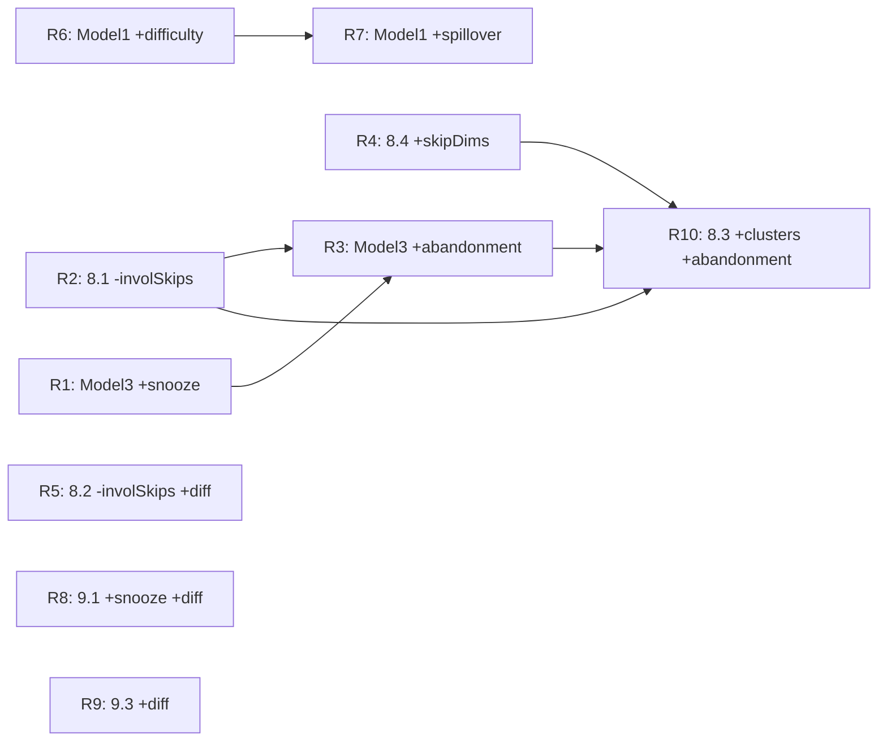

# PLAN-MODEL-RETRAINING.md — Sequential Model Retraining Plan

**Scope:** Extension of `PLAN-ML-EXTENSION.md`. Each retraining (R1..R10) is a self-contained session. One retraining per session. Opus plans, Sonnet implements.
**Conventions:** Inherits all rules from `PLAN.md`, `PLAN-ML-EXTENSION.md`, `STRUCTURE.md`, `.github/copilot-instructions.md`. Strategy + Dependency Inversion preserved. Math fallback in `MathHabitPredictor` updated for every retrain. No new UI unless explicitly listed.
**Status legend:** `[ ]` = not started · `[x]` = done.
**Database note:** No retraining in this document requires a schema change — all required columns already exist after `PLAN-ML-EXTENSION.md` Phase 9. If you ever see a DB version bump in this file, treat it as a mistake.

---

## Global Retraining Checklist (apply to every R-task)

Every R-task is "done" when ALL of the following are checked off in its own section:

- [ ] **Python — dataset:** Update `ml-training/generate_<model>_data.py` to append the new feature column(s). Re-run to regenerate `ml-training/data/<model>_dataset.csv`.
- [ ] **Python — training:** Update `ml-training/train_<model>_model.py` input shape, retrain, re-export `<model>.tflite` and `<model>_scaler.json` to `ml-training/models/`.
- [ ] **Python — evaluation:** Re-run `ml-training/evaluate_models.py` and confirm no metric regression (accuracy / F1 / MAE must not drop more than 2% vs. previous run). Record before/after metrics in the section's KDoc summary in this file.
- [ ] **Assets:** Copy refreshed `.tflite` + scaler JSON into `app/src/main/assets/`. Delete previous binaries (no parallel old copies).
- [ ] **Kotlin — features dataclass:** Extend the matching `domain/ai/*Features.kt` (or `ReminderContext.kt`) with the new field(s). Update `toFloatArray()` order to mirror Python `feature_columns` exactly.
- [ ] **Kotlin — use case:** Update the feature-extracting use case (e.g. `HabitSuccessUseCase`, `AbandonmentRiskUseCase`) to compute the new field from Room data. Inject any new DAO/UseCase dependency through the constructor (no service locators).
- [ ] **Kotlin — predictor impls:** Update `TfliteHabitPredictor` input tensor allocation for the new feature count. Update `MathHabitPredictor` rule-based fallback to use the new feature meaningfully (not just ignore it).
- [ ] **Kotlin — ViewModel/DI wiring:** Verify `AiContainer` (or whatever DI wires the use case) passes the new dependencies. No new ViewModel state usually needed.
- [ ] **KDoc:** Update KDoc on every changed Kotlin class to note the retrain version and new feature.
- [ ] **VS Code red imports:** Ignore. Per repo instructions, Android Studio build is authoritative.
- [ ] **Manual verification:** Build in Android Studio, run on emulator, confirm the affected screen still renders and feature still produces predictions in the expected range. No UI test code.

---

# R1 — Model 3 Reminder Template + `snoozeCount`

**Status:** `[x]`
**Trigger:** `PLAN-ML-EXTENSION.md` Phase 9.2 explicitly promised this and never did it.
**Goal:** Make reminder template selection sensitive to how many times the user already snoozed today, so heavy snoozers get gentler templates.

### Files touched
- `ml-training/generate_reminder_data.py`
- `ml-training/train_reminder_model.py`
- `app/src/main/assets/reminder_classifier.tflite`, `reminder_scaler.json`
- `domain/ai/ReminderContext.kt` — add `snoozeCountToday: Int`
- `domain/usecase/ScheduleReminderUseCase.kt` — read SharedPreferences counter `snooze_count_<habitId>` and inject
- `domain/ai/MathHabitPredictor.kt`, `TfliteHabitPredictor.kt`

### Math fallback rule
If `snoozeCountToday >= 2` → bias toward `gentle_nudge_at_risk` template regardless of other signals.

---

# R2 — 8.1 Abandonment — Exclude Involuntary Skips

**Status:** `[x]`
**Trigger:** Phase 9.5 added `HabitSkipEntity` with `SkipReason`, but `AbandonmentRiskUseCase` still treats SICK/TRAVELING gaps as abandonment signal. False positives.
**Goal:** Subtract days with involuntary skips (`SICK`, `TRAVELING`) from `daysSinceLastCompletion`-style features so a 10-day trip doesn't fire a CRITICAL abandonment alert.

### Files touched
- `ml-training/generate_abandonment_data.py` — add `involuntarySkipDays7d`, `involuntarySkipDays30d` columns; bake into label generator
- `ml-training/train_abandonment_model.py`
- `app/src/main/assets/habit_abandonment_classifier.tflite`, scaler JSON
- `domain/ai/AbandonmentFeatures.kt` — +2 fields
- `domain/usecase/AbandonmentRiskUseCase.kt` — inject `HabitSkipDao`, compute involuntary-skip-day counts
- Both predictor impls

### Math fallback rule
`adjustedDaysSinceLast = daysSinceLast - involuntarySkipDays7d`. Apply existing rule chain to the adjusted value.

---

# R3 — Model 3 Reminder Template + Abandonment Probability

**Status:** `[x]`
**Trigger:** Replace rule-based `ReminderContext.isAtRisk: Boolean` with the continuous output of Model 8.1.
**Goal:** Model stacking — Model 3 consumes Model 8.1's calibrated probability instead of a hard threshold.
**Dependency:** Do AFTER R1 (so we don't retrain Model 3 twice).

### Files touched
- `ml-training/generate_reminder_data.py` — replace `isAtRisk` column with `abandonmentProbability: float` in `[0,1]`. Regenerate label distribution so `gentle_nudge_at_risk` is selected smoothly across probabilities, not as a step function.
- `ml-training/train_reminder_model.py` — feature count unchanged (we replace, not add)
- Assets refresh
- `domain/ai/ReminderContext.kt` — change `isAtRisk: Boolean` → `abandonmentProbability: Float`. Update **all call sites**.
- `domain/usecase/ScheduleReminderUseCase.kt` — inject `AbandonmentRiskUseCase`, query probability per habit before scheduling
- Both predictor impls

### Math fallback rule
`abandonmentProbability >= 0.6` → behave like old `isAtRisk = true`.

### Migration note
This is a **breaking change** to `ReminderContext`. Grep for `isAtRisk` and update every reference. Expect ~3–5 call sites.

---

# R4 — 8.4 Behavioral Clustering + Skip Reason Dimensions

**Status:** `[x]`
**Trigger:** Phase 9.5 enables splitting "struggling" cluster into "disengaged" (high voluntary skips) vs. "life-disrupted" (high involuntary skips). Currently those are indistinguishable.
**Goal:** Re-fit K-Means with 2 added features. Possibly bump `n_clusters` from 4 → 5 if silhouette score supports it.

### Files touched
- `ml-training/generate_clustering_data.py` — add `voluntarySkipRate30d`, `involuntarySkipRate30d`
- `ml-training/train_clustering_model.py` — re-fit, re-export `habit_clusters.json` (no TFLite)
- `app/src/main/assets/habit_clusters.json`
- `domain/ai/ClusterFeatures.kt` — 5 → 7 fields
- `domain/model/BehavioralCluster.kt` — add new sealed case if `n_clusters` increased
- `domain/usecase/<clustering use case>.kt` — inject `HabitSkipDao`, compute skip-rate features
- `TfliteHabitPredictor.classifyBehavioralCluster` — adapt nearest-centroid math to higher dim
- `MathHabitPredictor.classifyBehavioralCluster` — extend threshold fallback

### Silhouette gate
If silhouette score drops below previous run, keep `n_clusters = 4`. Document decision in this file's KDoc summary.

### View update
If a new cluster is added, update the `BehavioralCluster` card in `StatisticsScreen` (icon + string resource). Otherwise no UI change.

---

# R5 — 8.2 Streak Break — Exclude Involuntary Skips + Add `perceivedDifficulty`

**Status:** `[x]`
**Trigger:** Same false-positive problem as R2 plus 9.4 difficulty signal unused.
**Goal:** Don't count travel/sickness streak gaps; let high-difficulty completions push break probability up even when streak is intact.

### Files touched
- `ml-training/generate_streak_break_data.py` — add `involuntarySkipDays7d`, `recentAvgDifficulty`
- `ml-training/train_streak_break_model.py`
- Assets refresh
- `domain/ai/StreakBreakFeatures.kt` — +2 fields
- Streak-break use case — inject `HabitSkipDao` + read `perceivedDifficulty` rolling avg from completions
- Both predictor impls

### Math fallback rule
`recentAvgDifficulty >= 4.0` boosts break probability by +0.15 even on intact streaks.

---

# R6 — Model 1 Success + `recentAvgDifficulty`

**Status:** `[ ]`
**Trigger:** `PLAN-ML-EXTENSION.md` Phase 9.4 marked this optional; mark it done.
**Goal:** Success prediction conditional on how hard recent completions felt.

### Files touched
- `ml-training/generate_success_data.py` — +1 column
- `ml-training/train_success_model.py` (7 → 8 input features)
- Assets refresh
- `domain/ai/HabitFeatures.kt` (a.k.a. `SuccessFeatures`) — +1 field
- `HabitSuccessUseCase` — compute rolling avg of `HabitCompletionEntity.perceivedDifficulty` over last 14 completions
- Both predictor impls

### Math fallback rule
Multiply the existing rule-based success probability by `(1.0 - 0.05 * (recentAvgDifficulty - 3.0))` clipped to `[0, 1]`.

---

# R7 — Model 1 Success + Spillover Lift Aggregate

**Status:** `[ ]`
**Trigger:** Phase 8.5 produces per-pair lifts but Model 1 ignores them.
**Goal:** Within-day momentum awareness — habits whose "partner habits" were already completed today get a higher predicted success.
**Dependency:** Do AFTER R6 (avoid retraining Model 1 twice).

### Files touched
- `ml-training/generate_success_data.py` — +1 column `spilloverLiftAggregate` ∈ [-0.5, +0.5]
- `ml-training/train_success_model.py` (8 → 9 input features)
- Assets refresh
- `domain/ai/HabitFeatures.kt` — +1 field
- `HabitSuccessUseCase` — inject `SpilloverUseCase`, sum lift deltas of every habit completed today that has a positive predicted spillover to the target habit
- Both predictor impls

### Math fallback rule
Add `clamp(spilloverLiftAggregate, -0.3, +0.3)` directly to fallback success probability and clip to `[0,1]`.

### Performance note
Spillover aggregation runs per habit per prediction. Cache in the use case (in-memory `Map<Int, Float>` keyed by habit + date) to avoid O(n²) re-evaluation on every Statistics screen refresh.

---

# R8 — 9.1 Reminder Lift + `snoozeCount` + `perceivedDifficulty`

**Status:** `[ ]`
**Trigger:** Causal lift estimator gets sharper when it knows the user is currently snoozing heavily or rating recent completions hard.
**Goal:** A heavily-snoozing user with high difficulty rating has lower realistic lift from another reminder — model should learn to recommend suppression.

### Files touched
- `ml-training/generate_reminder_lift_data.py` — +2 columns
- `ml-training/train_reminder_lift_model.py`
- Assets refresh
- `domain/ai/ReminderLiftFeatures.kt` — +2 fields
- Reminder-lift use case — already has access to completions; add `HabitSkipDao` only if SharedPreferences snooze counter access isn't already wired
- Both predictor impls

### Math fallback rule
If `snoozeCountToday >= 3` AND `recentAvgDifficulty >= 4.0` → return predicted lift = 0 (suppress reminder).

---

# R9 — 9.3 Target Change + `perceivedDifficulty` Rolling Avg

**Status:** `[ ]`
**Trigger:** Phase 9.4 promised "Combine with targetVersion model to suggest target changes weighted by user-reported difficulty." Not done.
**Goal:** Recommended delta becomes negative more easily when difficulty is consistently high, even if completion rate looks acceptable.

### Files touched
- `ml-training/generate_target_change_data.py` — +1 column
- `ml-training/train_target_change_model.py`
- Assets refresh
- `domain/ai/TargetChangeFeatures.kt` — +1 field
- Adaptive Difficulty v2 use case — already reads completions; add the rolling-avg computation
- Both predictor impls

### Math fallback rule
If `recentAvgDifficulty >= 4.0` AND rate30d >= 0.8 → recommend `delta = -1` (counterintuitive but correct: the user is succeeding through grinding, not because the target is calibrated).

---

# R10 — 8.3 Weekly Forecast + Cluster Distribution + Avg Abandonment Risk

**Status:** `[ ]`
**Trigger:** Weekly forecast currently ignores newer per-habit ML model outputs.
**Goal:** User-level aggregate of new model outputs feeds the user-level forecast.
**Dependency:** Last — depends on R2, R3, R4 to produce stable upstream outputs first.

### Files touched
- `ml-training/generate_weekly_forecast_data.py` — +5 columns: `clusterCounts[4 or 5]` one-hot proportions, `avgAbandonmentRisk`
- `ml-training/train_weekly_forecast_model.py`
- Assets refresh
- `domain/ai/WeeklyForecastFeatures.kt` — +N fields
- `WeeklyForecastUseCase` — inject clustering use case + `AbandonmentRiskUseCase`, aggregate over all active habits
- Both predictor impls

### Math fallback rule
Existing naive blend `0.7 * lastWeek + 0.3 * month` minus `0.1 * avgAbandonmentRisk`, clipped to `[0, 1]`.

---

# Execution Order Summary

**Recommended order (one per session):** R1 → R2 → R3 → R4 → R5 → R6 → R7 → R8 → R9 → R10.

---

# Per-Session KDoc Summary Slot

After completing each R-task, append a 3-line summary here:

- **R1 — 2026-05-26:** before acc=N/A (no prior baseline), after acc=0.7327 (20k rows). Notes: snoozeCountToday added as 8th feature; Rule 0 math fallback matches Python Rule 0.
- **R2 — 2026-05-26:** before F1=N/A (7-feature baseline acc=0.7327 per R1, no F1 recorded), after F1=0.7505, acc=0.7881, AUC=0.8504 (50k rows). Notes: involuntarySkipDays7d and involuntarySkipDays30d added as features 8 & 9; adjusted_gap = daysSinceLast − involuntarySkipDays7d applied in both Python logit rules and MathHabitPredictor fallback.
- **R3 — 2026-05-26:** before acc=0.7327 (R1, binary isAtRisk), after acc=0.7476, macro F1=0.621, weighted F1=0.729 (50k rows, Dense 32→16→15, threshold 0.65). abandonmentProbability: Float [0,1] from AbandonmentRiskUseCase replaces isAtRisk: Boolean; math fallback threshold ≥0.6 mirrors Python Rule 2; 4-component collinearity-broken synthesis.
- **R4 — 2026-05-26:** before silhouette=0.3753 (5-feature K=4), after silhouette_K4=0.4461, silhouette_K5=0.3683, chosen K=4 (K=5 failed gate: sil_K5 ≥ 0.4261). voluntarySkipRate30d + involuntarySkipRate30d added as features 6 & 7; K-Means organically captured life-disrupted behavior in consistent_effort cluster; math fallback unchanged.
- **R5 — 2026-05-26:** before F1=N/A (no 9-feature baseline), after acc=0.7655, macro F1=0.7551, AUC=0.8485 (50k rows). Notes: involuntarySkipDays7d (field 8) + recentAvgDifficulty (field 9) added to StreakBreakFeatures; difficulty boost +0.15 in MathHabitPredictor when recentAvgDifficulty ≥ 4.0f (Rule 8); involuntarySkipDays7d is TFLite-only (no math fallback rule); StreakBreakUseCaseTest added (11 tests, all green).
- **R6 — 2026-05-26:** before acc=N/A (no 7-feature baseline recorded), after acc=0.8240, AUC=0.8939 (30k rows, 50 epochs — passed on first attempt). recentAvgDifficulty added as 8th feature to HabitSuccessClassifier; logit penalty −0.5*(difficulty−3.0) in training data; difficulty multiplier (1−0.05*(d−3.0)) added to MathHabitPredictor fallback; SuccessProbabilityUseCase switched from successProbability() to predictSuccess(HabitFeatures), wiring TFLite inference end-to-end for the first time.
